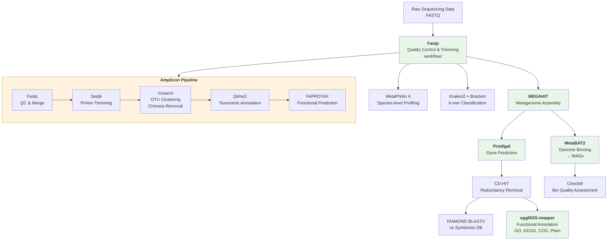

# iSymBase: Insect Symbiont Database & Analysis Platform

[](https://opensource.org/licenses/MIT)
[](https://www.python.org/downloads/)
[](https://github.com/midjuly/iSymBase)

## 🔬 Overview

**iSymBase** is a comprehensive database and analysis platform dedicated to insect symbiont research. This repository contains the complete source code, bioinformatics workflows, and AI-enhanced query system that powers the iSymBase database, providing researchers with transparent access to methodologies and algorithms used in insect-microbe symbiosis studies.

### Key Features

- 🧬 **Comprehensive Metagenomics Pipeline**: Complete workflow from raw sequencing data to functional annotation
- 🤖 **AI-Enhanced Query System (iSymSeek)**: RAGflow-powered intelligent search with domain-specific knowledge bases
- 📊 **Multi-omics Analysis**: Integration of taxonomic profiling, genome assembly, and functional annotation
- 🔍 **Transparent Methodology**: Open-source implementation of all analytical methods and AI models
- 📚 **Extensive Documentation**: Detailed protocols and parameter explanations for reproducibility

## 🏗️ Repository Structure

```
iSymBase/
├── workflow/           # Bioinformatics analysis pipelines
│   ├── Fastp Quality Control.md
│   ├── MetaPhIAn Taxonomic Profiling.md
│   ├── Megahit Metagenome Assembly.md
│   ├── Prodigal Gene Prediction.md
│   ├── eggNOG-mapper Gene Annotation.md
│   ├── Kraken Taxonomic Profiling.md
│   ├── Metabat2 Metagenome Binning.md
│   └── Amplicon Data Process.md
├── scripts/           # Utility scripts and tools
│   ├── extract_seq.py
│   └── metaphlan2krona.py
├── isymseek/         # AI-enhanced query system
│   ├── RAGflow Workflow for iSymBase Enhancement.md
│   ├── ragflow_config.json
│   ├── query.py
│   └── knowledgebase demo/
├── database/         # Database schema and construction
│   ├── README.md
│   └── build_symbionts_db.py
└── LICENSE           # MIT License
```

## 📋 Bioinformatics Workflows

### Pipeline Overview

The following diagram shows how the analysis workflows connect. Two parallel pipelines are provided: **metagenomics** (whole-genome shotgun sequencing) and **amplicon** (16S rRNA / ITS marker gene sequencing).



**Key**: Green = Metagenomics core workflow | Orange = Amplicon workflow

*Input/output connections between sequential steps are indicated by arrows. Each workflow document in the `workflow/` directory provides detailed commands, parameter explanations, and example outputs.*

### Core Analysis Pipeline

1. **[Quality Control & Preprocessing](workflow/Fastp%20Quality%20Control.md)**
   - Raw sequencing data quality assessment and trimming
   - Adapter removal and filtering protocols
   - Batch processing guidelines

2. **[Taxonomic Profiling](workflow/MetaPhIAn%20Taxonomic%20Profiling.md)**
   - Species-level microbial community composition analysis
   - MetaPhlAn 4 implementation with 5.1M unique marker genes
   - Alternative approach: [Kraken2 Taxonomic Profiling](workflow/Kraken%20Taxonomic%20Profiling.md)

3. **[Metagenome Assembly](workflow/Megahit%20Metagenome%20Assembly.md)**
   - De novo assembly of metagenomic sequences
   - Parameter optimization for different sample types
   - Quality assessment and validation

4. **[Gene Prediction](workflow/Prodigal%20Gene%20Prediction.md)**
   - Prokaryotic gene identification and annotation
   - Metagenomic mode optimization
   - Output format specifications

5. **[Functional Annotation](workflow/eggNOG-mapper%20Gene%20Annotation.md)**
   - Orthology-based functional assignment
   - GO, KEGG, COG, and Pfam domain annotations
   - Large-scale annotation protocols

### Specialized Workflows

- **[Genome Binning](workflow/Metabat2%20Metagenome%20Binning.md)**: Metagenome-assembled genome (MAG) reconstruction
- **[Amplicon Analysis](workflow/Amplicon%20Data%20Process.md)**: 16S rRNA gene sequencing analysis protocols

## 🤖 iSymSeek: AI-Enhanced Query System

### Overview

The [iSymSeek system](isymseek/RAGflow%20Workflow%20for%20iSymBase%20Enhancement.md) integrates deepseek-based AI models with RAGflow to provide intelligent querying capabilities for the iSymBase database.

### Knowledge Base Architecture

- **Literature Knowledge Base**: 106 core publications with OCR processing
- **Table Knowledge Base**: 2,665 symbiont-host relationship records
- **Manual Knowledge Base**: Curated operational procedures and guidelines
- **FAQ Knowledge Base**: Common queries and troubleshooting guides

### Implementation Details

See the complete [RAGflow workflow documentation](isymseek/RAGflow%20Workflow%20for%20iSymBase%20Enhancement.md) for:
- System architecture and design principles
- Knowledge base construction methodology
- Query processing algorithms
- Performance evaluation metrics

Reference implementation files:
- **[ragflow_config.json](isymseek/ragflow_config.json)**: Knowledge base configuration with chunk methods, embedding model, and retrieval parameters for all four knowledge bases.
- **[query.py](isymseek/query.py)**: Python implementation of the RAG pipeline, demonstrating vector store retrieval and LLM query augmentation. Requires `openai`, `chromadb`, and `sentence-transformers` packages.

## 🛠️ Utility Scripts

### Available Tools

- **[Sequence Extraction](scripts/extract_seq.py)**: Filter sequences by length threshold
- **[Format Conversion](scripts/metaphlan2krona.py)**: Convert MetaPhlAn output for Krona visualization

### Usage Examples

Refer to individual script documentation for detailed usage instructions and parameter specifications.

## 🔍 Transparency & Reproducibility

This repository is designed to provide full methodological transparency for the iSymBase project. The following describes what is covered and the scope of documentation provided.

### What Is Documented

- **Bioinformatics workflows**: Each analysis step in `workflow/` includes software version references, complete command lines, parameter explanations, and example output files to enable independent replication.
- **Database schema**: The `database/README.md` describes the structure, field definitions, and relationships of all four core data tables (Symbiont Records, Metagenomes, Amplicons, Insect Hosts).
- **Custom database construction**: The `database/build_symbionts_db.py` script documents how the Symbionts reference protein database is filtered from NCBI NR by taxonomy.
- **AI query system architecture**: The iSymSeek RAGflow workflow document describes the knowledge base design, embedding model selection, chunking strategy, and parameter choices used in the retrieval-augmented generation pipeline. A reference implementation is provided in `isymseek/query.py` and `isymseek/ragflow_config.json`.
- **Utility scripts**: Python tools for sequence length filtering (`scripts/extract_seq.py`) and MetaPhlAn-to-Krona format conversion (`scripts/metaphlan2krona.py`).

### Reproducibility Notes

- **Software versions**: Specific tool versions are noted in each workflow document where applicable. A unified Conda environment specification can be generated from the installation commands provided in each workflow.
- **Reference databases**: Versions and download sources for all reference databases (MetaPhlAn markers, EggNOG 5.0, Kraken2 database, Greengenes v13.5) are indicated in the respective workflow documents.
- **Example data**: All workflow examples use publicly available NCBI SRA run accessions, enabling direct reproduction with the same input data.

## 🔧 Installation & Setup

### System Requirements

- **Operating System**: Linux/Unix (recommended), macOS, Windows (with WSL)
- **Memory**: Minimum 16GB RAM (32GB+ recommended for large datasets)
- **Storage**: 100GB+ available disk space
- **Software**: Python 3.7+, Conda/Mamba package manager

### Quick Start

1. **Clone Repository**
   ```bash
   git clone https://github.com/midjuly/iSymBase.git
   cd iSymBase
   ```

2. **Environment Setup**
   Follow the installation guides in individual workflow documentation

3. **Workflow Execution**
   Refer to specific workflow markdown files for detailed protocols

## 📚 Documentation Navigation

### For Researchers
- Start with [Quality Control](workflow/Fastp%20Quality%20Control.md) for data preprocessing
- Follow the sequential workflow documentation for complete analysis
- Consult [iSymSeek documentation](isymseek/) for AI-assisted queries

### For Developers
- Review utility scripts in `/scripts/` directory
- Examine RAGflow implementation details
- Contribute following the guidelines below

### For Database Users
- Access the [FAQ knowledge base](isymseek/knowledgebase%20demo/)
- Utilize the AI-enhanced query system for information retrieval

## 🤝 Contributing

We welcome contributions from the research community. Please:

1. Fork the repository
2. Create feature branches for new workflows or improvements
3. Follow existing documentation standards
4. Submit pull requests with comprehensive descriptions

### Development Guidelines

- Maintain consistency with existing workflow documentation format
- Include parameter explanations and troubleshooting sections
- Provide example datasets and expected outputs where applicable
- Update this README when adding new components

## License

This project is licensed under the MIT License - see the [LICENSE](LICENSE) file for details.

## Contact & Support

- **Repository Issues**: [GitHub Issues](https://github.com/midjuly/iSymBase/issues)
- **Documentation Questions**: Refer to individual workflow files
- **Technical Support**: Community-driven support through GitHub discussions

## Citation

If you use iSymBase workflows or methodologies in your research, please cite appropriately and reference the specific workflow documentation used.


**Note**: This repository represents our commitment to open science and transparent research practices. All methodologies, algorithms, and data processing steps are fully documented and reproducible, directly addressing concerns about reliability and transparency in computational biology research.